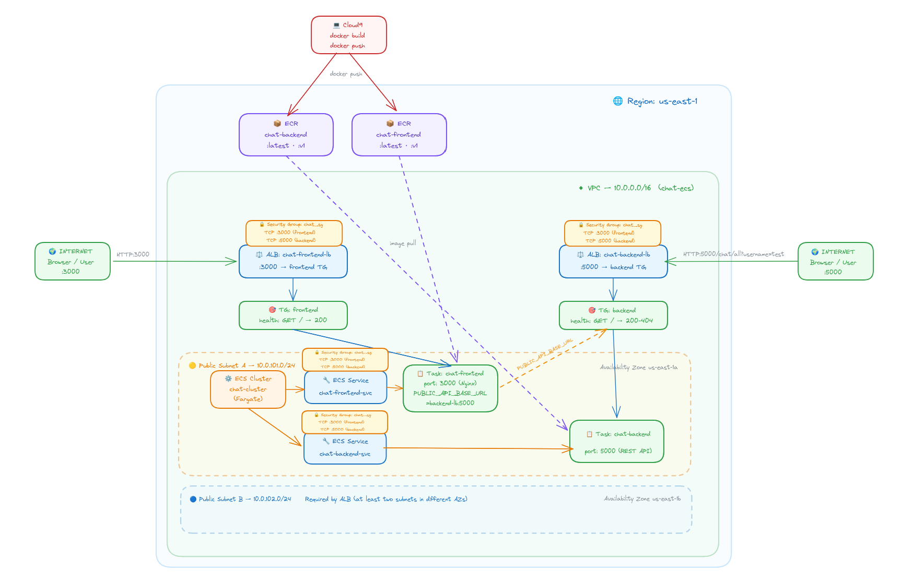

# Lab 12 - ECS Chat Application with RDS and CloudWatch

This laboratory deploys a chat application on AWS using Terraform. The stack runs the frontend and backend on ECS Fargate, stores chat data in PostgreSQL on RDS, exposes the app through a single Application Load Balancer, and sends CloudWatch alarms by e-mail.

## Architecture

The application uses the following AWS services:

- VPC with public and private subnets
- Application Load Balancer for public access
- Two ECS Fargate services, one for the frontend and one for the backend
- Amazon ECR repositories for container images
- Amazon RDS PostgreSQL for persistence
- Amazon SNS and CloudWatch alarms for monitoring

The topology is summarized in the diagram below:



Traffic flow:

- `/` routes to the frontend service
- `/chat` and `/chat/*` route to the backend service
- The backend connects to RDS in private subnets
- ECS tasks use the private subnets and a NAT Gateway for outbound access

## Terraform Resources

The infrastructure is defined entirely in Terraform:

- `main.tf` creates the VPC, security groups, RDS database, ECR repositories, ECS cluster, task definitions, services, load balancer, SNS topic, and CloudWatch alarms.
- `variables.tf` defines the input values used by the deployment.

The key resources are:

- `aws_db_instance.chat_db` for the PostgreSQL database
- `aws_ecs_cluster.chat_cluster` for the ECS cluster
- `aws_ecs_service.backend_svc` and `aws_ecs_service.frontend_svc` for the running application
- `aws_lb.chat_alb` for the public entry point
- `aws_sns_topic.monitoring_alerts` for alarm notifications
- `aws_cloudwatch_metric_alarm.cpu_high` for CPU alarms
- `aws_cloudwatch_metric_alarm.all_tasks_stopped` for the stopped-tasks alarm

## Monitoring With CloudWatch

CloudWatch monitoring is configured for the two ECS services in the application.

### CPU alarm

CPU alarms are created for both the backend and the frontend service. The threshold is controlled by the Terraform input variable `cpu_high_threshold`.

When the CPU utilization of either service stays above the threshold, CloudWatch sends an e-mail through the SNS topic.

### Tasks stopped alarm

The `chat-all-tasks-stopped` alarm watches the running task count of both ECS services. If the total number of running tasks drops to zero, CloudWatch sends an e-mail alert.

### E-mail notifications

Notifications are delivered through an SNS topic with an e-mail subscription. The first deployment creates the subscription, but the recipient must confirm it from the e-mail AWS sends.

## Input Variables

The deployment expects these variables:

- `db_username`: PostgreSQL master username
- `db_password`: PostgreSQL master password
- `notification_email`: e-mail address that receives CloudWatch notifications
- `cpu_high_threshold`: CPU percentage used by the CloudWatch alarm

The CPU threshold is validated to stay between 1 and 100.

## Deploying The Stack

1. Initialize Terraform:

```bash
terraform init
```

2. Apply the stack with your values:

```bash
terraform apply \
  -var="db_username=admin" \
  -var="db_password=<secret>" \
  -var="notification_email=<your-email@example.com>" \
  -var="cpu_high_threshold=75"
```

3. Build and push the container images to ECR:

```bash
bash build_and_push.sh
```

4. Confirm the SNS subscription from the e-mail AWS sends to `notification_email`.

After the deployment finishes, Terraform prints the application URL and the ECR repository URLs.

## Database Schema

The PostgreSQL database stores chat messages in a single table with these columns:

- `id`
- `username`
- `message`
- `timestamp`

The schema is created by `init.sql` and is used by the backend to persist messages across container restarts.

## Result

After deployment, the application is reachable through the ALB, chat data persists in RDS, and CloudWatch sends e-mail alerts when:

- the CPU load of either ECS service exceeds the configured threshold
- all application tasks stop running
