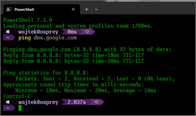

# Lab6 Report

Authors:
- Author 1 Name - author 1 contribution
- Author 2 Name - author 2 contribution

## Configuration

Put the real values and settings applied in your project.

## Verification of the solution

Put here pictures of commands testing Internet connectivity. Resize big pictures to make them smaller, but legible.

## Your feedback and reflections

What do you think about using Terraform to build cloud configuration.

Did you encounter any obstacles? Was there something difficult for you?