# Lab9 Report - Chat Application

## Author Contributions

| Task                                        | Gonzalo Morte Gómez | Jose Daniel Moya Moreno |
| ------------------------------------------- | ------------------- | ----------------------- |
| Terraform setup (VPC, Security Group)       |                     | X                       |
| ECR repository creation (frontend, backend) |                     | X                       |
| Docker build & push to ECR                  | X                   |                         |
| ECS Cluster, Services & Task Definitions    | X                   |                         |
| Load Balancers, Target Groups & Listeners   |                     | X                       |
| Shell script (clone, build, push)           | X                   |                         |
| README                                      | X                   | X                       |

## Lab Topology

The chat application consists of two containers: a **frontend** (Nginx serving a static build, port 3000) and a **backend** (REST API, port 5000). Each container runs as a separate ECS Fargate service, each behind its own Application Load Balancer. The frontend receives `PUBLIC_API_BASE_URL` as an environment variable pointing to the backend load balancer DNS, so the two services communicate via the load balancer rather than directly.

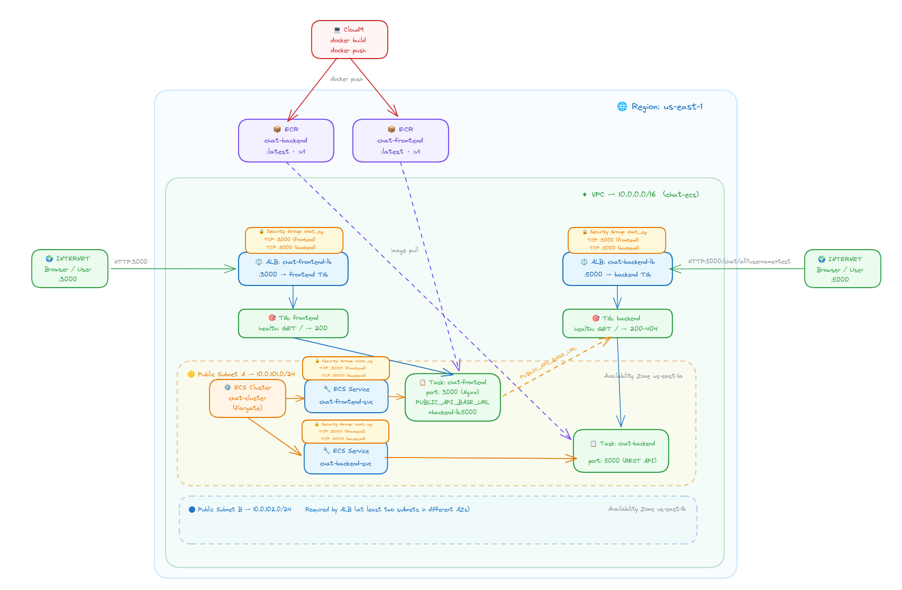

## Configuration

### After `terraform apply`

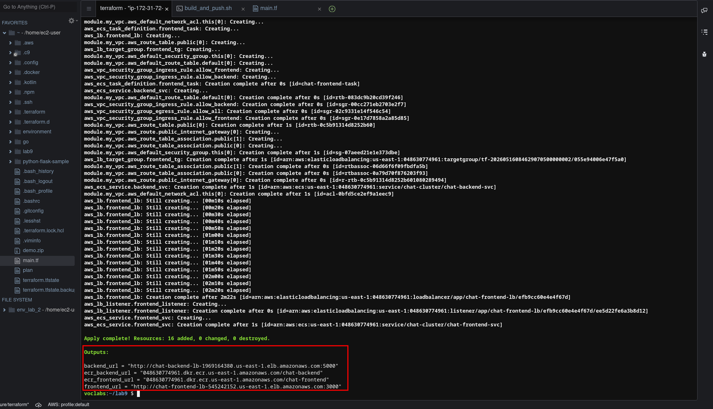

### VPC & Security Group

- CIDR: `10.0.0.0/16`
- Two public subnets in `us-east-1a` and `us-east-1b` (required by ALB)
- Security group `chat_sg`: inbound TCP port 3000 (frontend) and 5000 (backend), all outbound

Two separate ingress rules are needed because the chat app exposes two different ports:

```terraform
resource "aws_vpc_security_group_ingress_rule" "allow_frontend" {
  security_group_id = aws_security_group.chat_sg.id
  cidr_ipv4         = "0.0.0.0/0"
  ip_protocol       = "tcp"
  from_port         = 3000
  to_port           = 3000
}

resource "aws_vpc_security_group_ingress_rule" "allow_backend" {
  security_group_id = aws_security_group.chat_sg.id
  cidr_ipv4         = "0.0.0.0/0"
  ip_protocol       = "tcp"
  from_port         = 5000
  to_port           = 5000
}
```

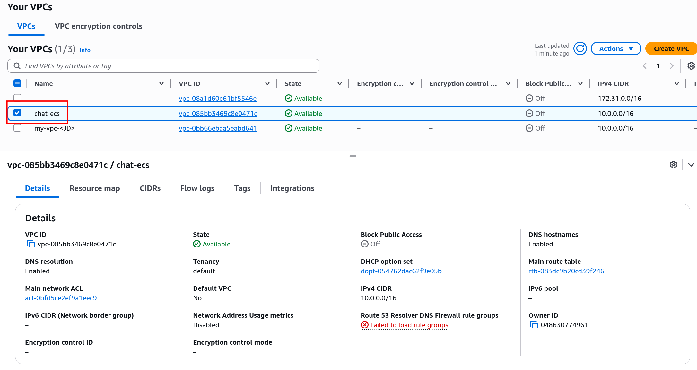

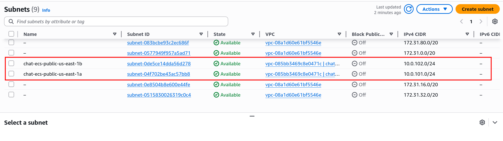

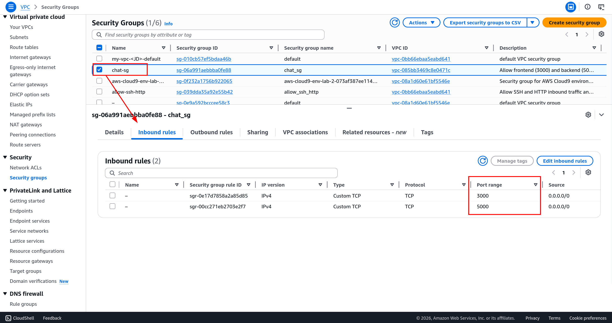

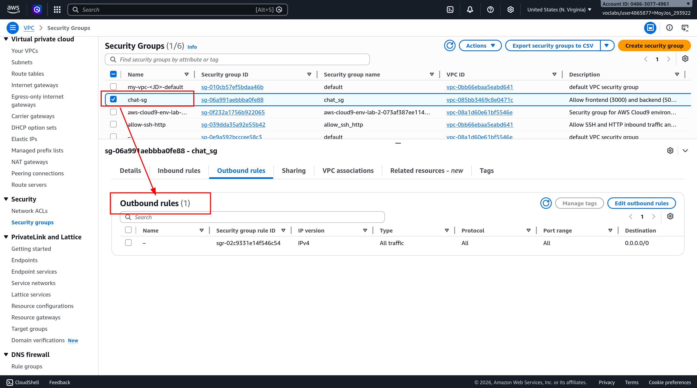

### ECR Repositories

Two separate repositories were created:

- `chat-backend`: image scanning on push enabled
- `chat-frontend`: image scanning on push enabled
- Tags pushed: `latest`, `v1`

Having two repositories reflects the independent lifecycle of each service: the backend and frontend can be versioned, rebuilt, and deployed separately.

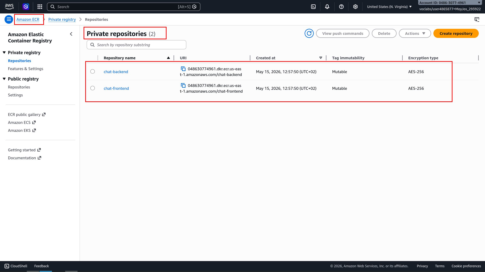

### Shell Script: Clone, Build & Push

A shell script automates the full pipeline: cloning the private repository, building both images, tagging them for ECR, and pushing them. The most important parts are:

**ECR login**: the token expires after 12 hours, so it must be refreshed each session:

```bash
aws ecr get-login-password --region "$REGION" \
  | docker login --username AWS --password-stdin "$ECR_BASE"
```

**Building both images** from their respective subdirectories:

```bash
docker build -t chat-backend:latest -t chat-backend:v1 ./backend
docker build -t chat-frontend:latest -t chat-frontend:v1 ./frontend
```

**Tagging and pushing** with both `latest` and versioned tags:

```bash
docker tag chat-backend:latest "${ECR_BASE}/chat-backend:latest"
docker push "${ECR_BASE}/chat-backend:latest"
docker push "${ECR_BASE}/chat-backend:v1"
# same for frontend
```

The second push of each image (`:v1`) is significantly faster because Docker layers are already cached in ECR from the `:latest` push.

### ECS Task Definitions

Two task definitions were created, one per service. Key parameters:

| Parameter   | Backend           | Frontend          |
| ----------- | ----------------- | ----------------- |
| CPU         | 256               | 256               |
| Memory      | 512 MB            | 512 MB            |
| Network     | awsvpc            | awsvpc            |
| Launch type | FARGATE           | FARGATE           |
| Port        | 5000              | 3000              |

The most important difference from the demo is the environment variable passed to the frontend task, which tells it where to reach the backend. The value is automatically resolved from the backend load balancer resource:

```terraform
"environment": [
  {
    "name": "PUBLIC_API_BASE_URL",
    "value": "http://${aws_lb.backend_lb.dns_name}:5000"
  }
]
```

This avoids hardcoding the backend URL, Terraform interpolates the actual DNS name of the backend ALB at apply time.

### Load Balancers

Two Application Load Balancers were created:

- `chat-backend-lb`: public, listener on port 5000, forwards to backend target group
- `chat-frontend-lb`: public, listener on port 3000, forwards to frontend target group

The backend health check uses `matcher = "200-404"` because the backend has no route defined at `/` (it returns a Spring Boot 404 page), which is still a valid sign that the container is alive:

```terraform
health_check {
  path     = "/"
  matcher  = "200-404"
  ...
}
```

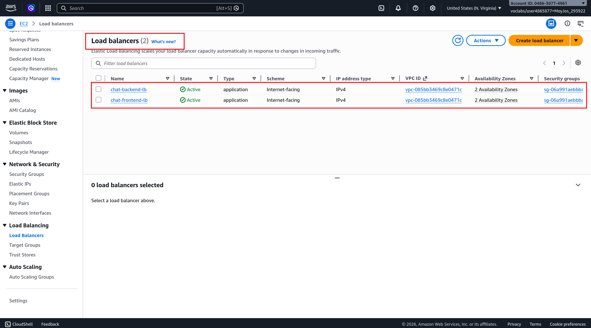

## Verification

### ECR - Images Published

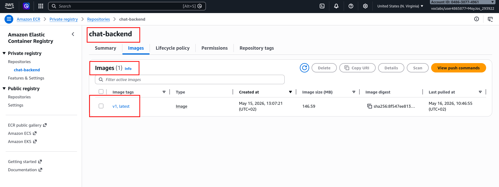

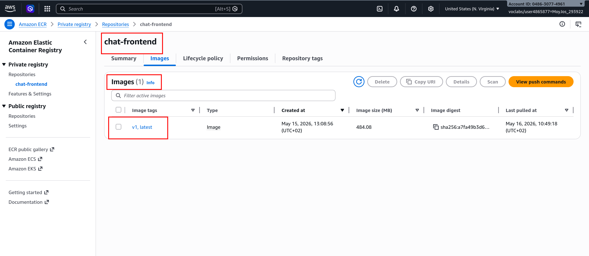

### ECS Cluster & Running Tasks

Both services show `1/1` Tasks running:

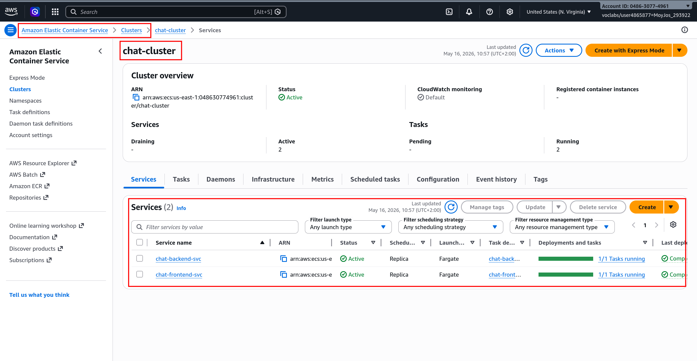

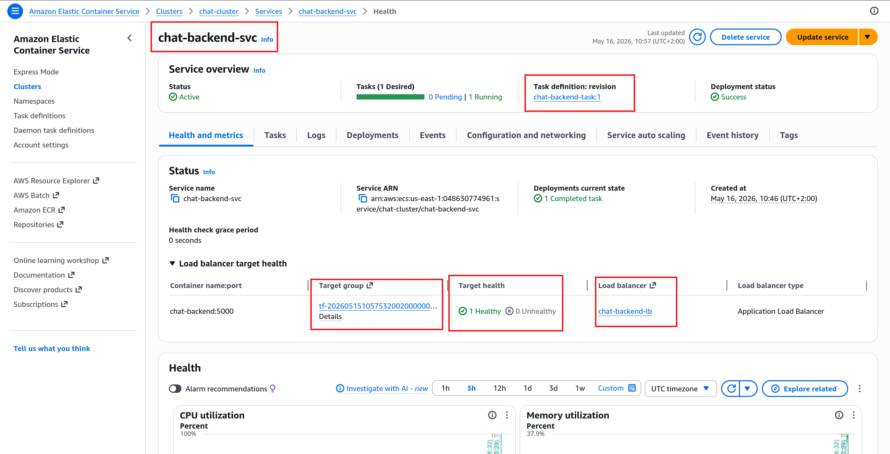

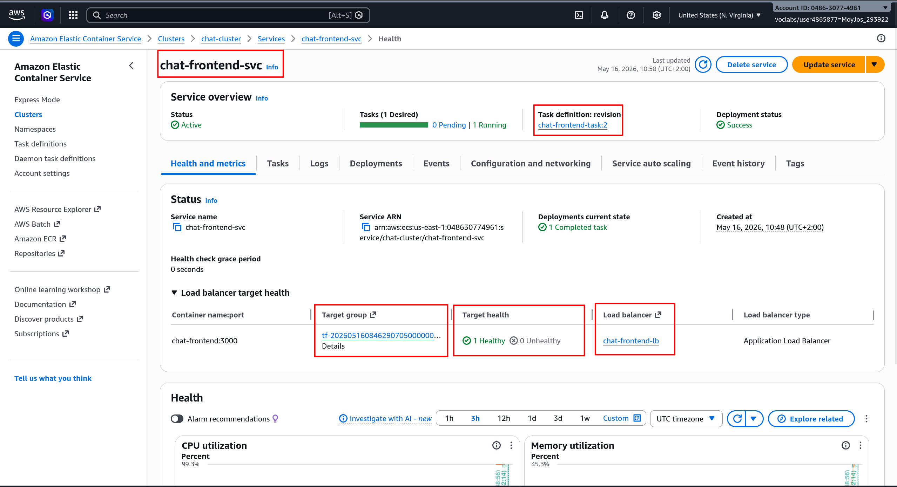

### Chat App Running via Load Balancer DNS

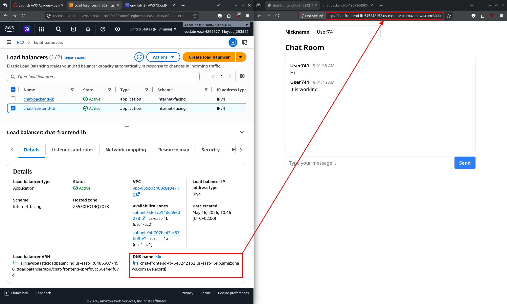

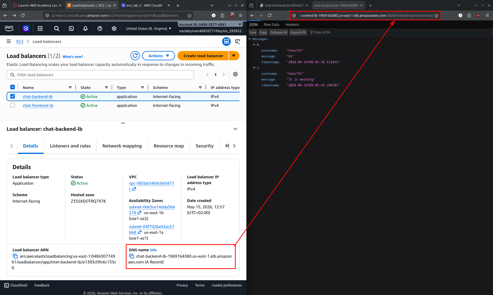

### Backend Reachable via Load Balancer DNS

Opening `http://<chat-backend-lb-dns>:5000` directly returns an error page (expected no root route defined).

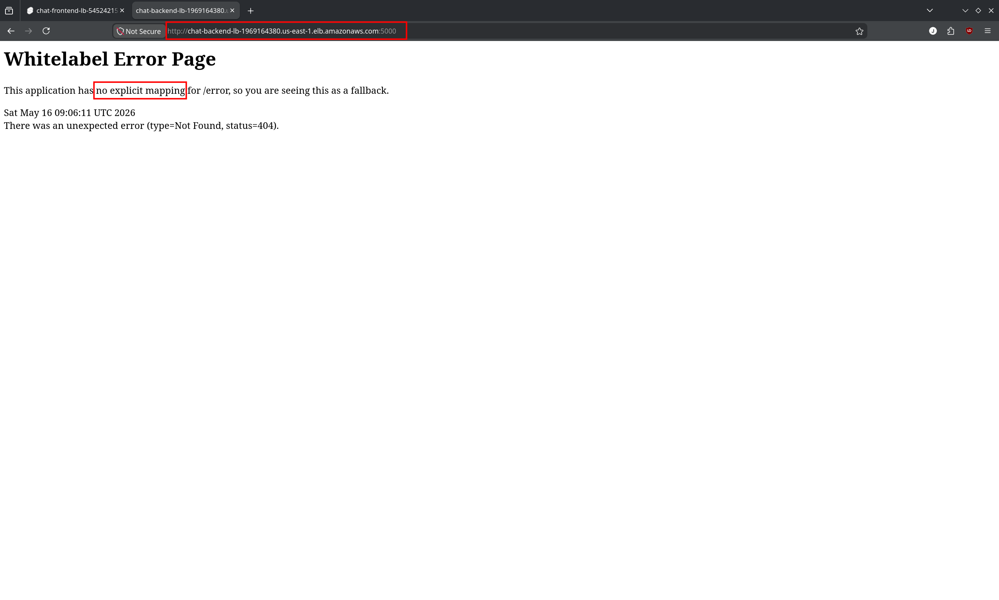

## Your Feedback and Reflections

***What do you think about using ECS and ECR to deploy containerized applications?***

ECS and ECR together provide a clean, fully managed way to deploy containerized applications without worrying about the underlying infrastructure. Using Fargate removes the need to provision or manage any servers, you define what each container needs (CPU, memory, port, environment variables) in a task definition, push your image to ECR, and AWS handles the rest.

***Did you encounter any obstacles? Was there something difficult for you?***

The main challenge was coordinating two services that need to communicate with each other. Since Fargate containers get ephemeral IPs, the frontend cannot talk to the backend via `localhost` or a fixed IP, it must go through the backend load balancer. This required passing the backend ALB DNS name as `PUBLIC_API_BASE_URL` into the frontend task definition, using Terraform interpolation to avoid hardcoding it.

## Additional Learnings

***Why two separate ECS services instead of one task with two containers***

Running the frontend and backend as separate ECS services allows them to scale, deploy, and fail independently. If the backend crashes, the frontend service keeps running. It also means you can update one image without redeploying the other. Placing both in a single task definition would couple their lifecycles and make independent scaling impossible.

***Why two load balancers are needed***

Each service needs its own stable public endpoint. A single ALB could technically route to both using path-based rules, but since the frontend and backend use different ports (3000 and 5000), the simplest and cleanest solution is one ALB per service, each listening on its respective port.

***How `PUBLIC_API_BASE_URL` is wired through Terraform***

Rather than hardcoding the backend DNS name in the frontend task definition, Terraform's interpolation syntax (`${aws_lb.backend_lb.dns_name}`) is used directly inside the `container_definitions` JSON. This means the correct backend URL is always injected automatically at `terraform apply` time, regardless of what AWS assigns as the DNS name.

***Why two tags (`latest` + version) on container images***

Pushing both `:latest` and `:v1` serves different purposes. The `:latest` tag always points to the most recent image, making it convenient as a default for ECS to pull. The `:v1` tag is a immutable reference to that specific build, useful for rollbacks and auditability.
