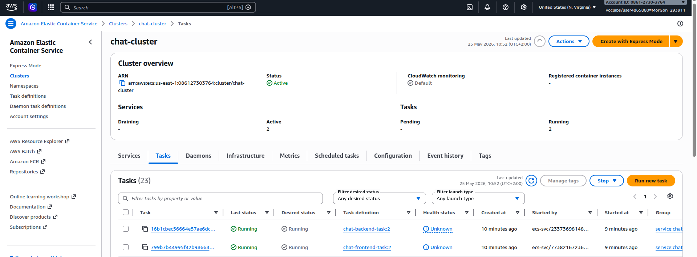
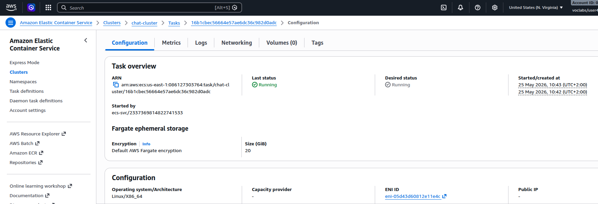
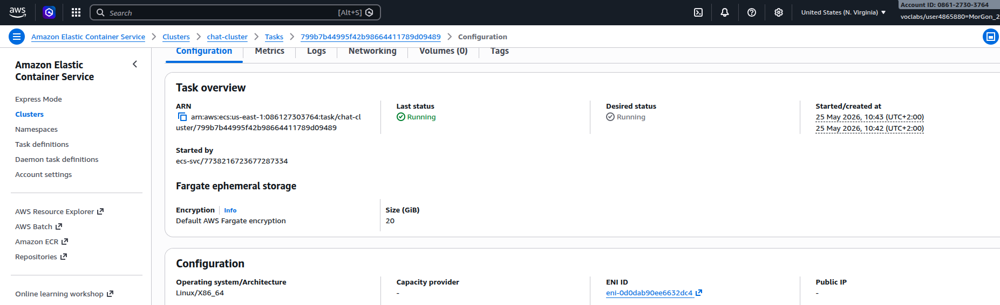
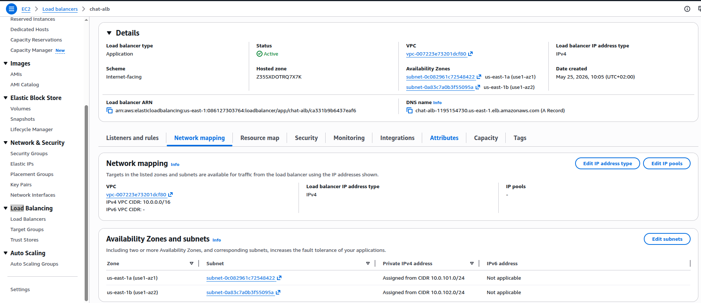
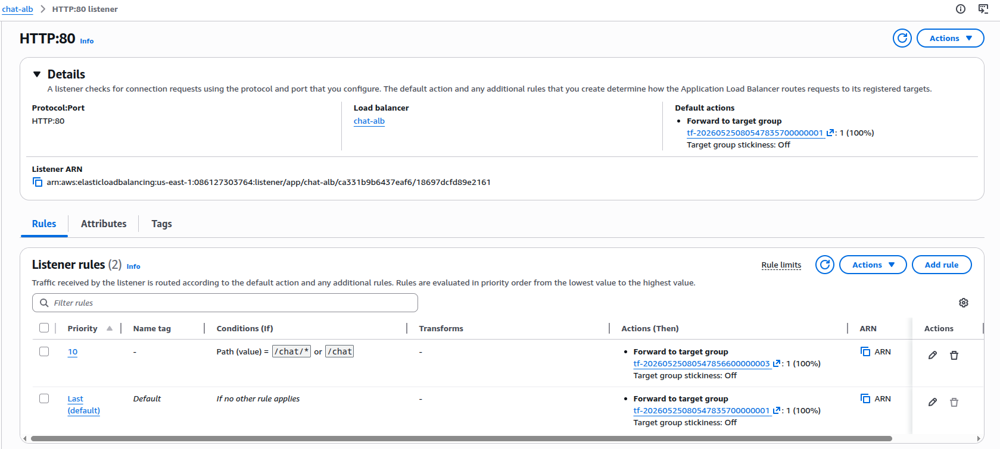
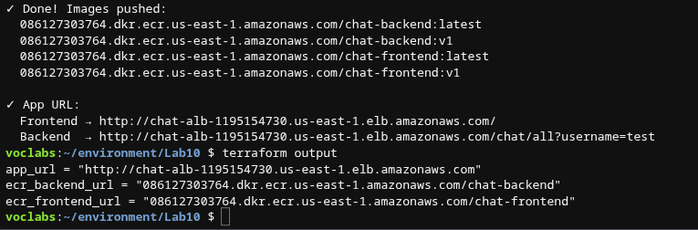
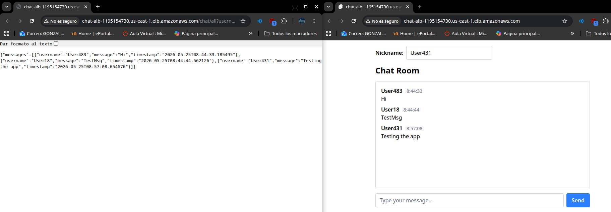
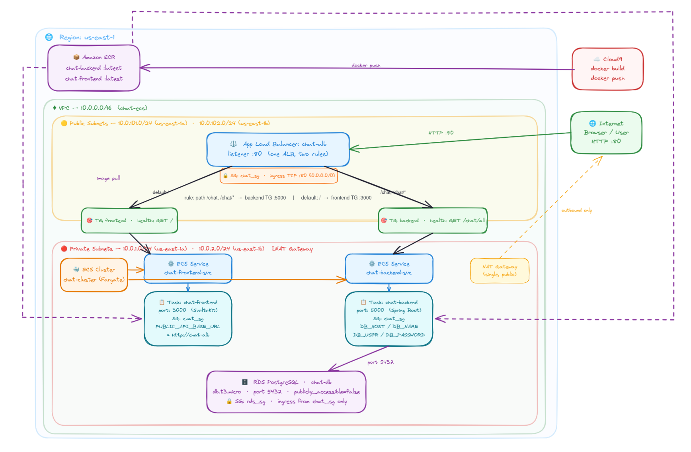
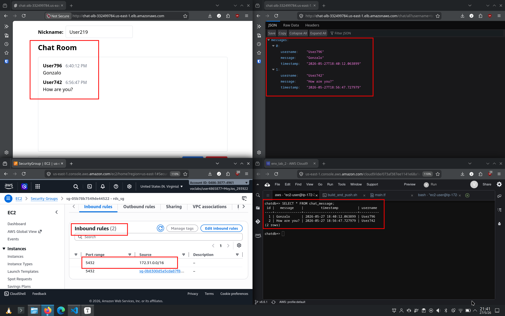

# Lab9 Report - Chat Application

## Author Contributions

| Task                                        | Gonzalo Morte Gómez | Jose Daniel Moya Moreno |
| ------------------------------------------- | ------------------- | ----------------------- |
| Terraform setup (VPC, Security Group)       |                     | X                       |
| ECR repository creation (frontend, backend) |                     | X                       |
| Docker build & push to ECR                  | X                   |                         |
| ECS Cluster, Services & Task Definitions    | X                   |                         |
| Load Balancers, Target Groups & Listeners   |                     | X                       |
| Shell script (clone, build, push)           | X                   |                         |
| README                                      | X                   | X                       |

## Lab Topology

The chat application consists of two containers: a **frontend** (Nginx serving a static build, port 3000) and a **backend** (REST API, port 5000). Each container runs as a separate ECS Fargate service, each behind its own Application Load Balancer. The frontend receives `PUBLIC_API_BASE_URL` as an environment variable pointing to the backend load balancer DNS, so the two services communicate via the load balancer rather than directly.


## Configuration

### After `terraform apply`


### VPC & Security Group

- CIDR: `10.0.0.0/16`
- Two public subnets in `us-east-1a` and `us-east-1b` (required by ALB)
- Security group `chat_sg`: inbound TCP port 3000 (frontend) and 5000 (backend), all outbound

Two separate ingress rules are needed because the chat app exposes two different ports:

```terraform
resource "aws_vpc_security_group_ingress_rule" "allow_frontend" {
  security_group_id = aws_security_group.chat_sg.id
  cidr_ipv4         = "0.0.0.0/0"
  ip_protocol       = "tcp"
  from_port         = 3000
  to_port           = 3000
}

resource "aws_vpc_security_group_ingress_rule" "allow_backend" {
  security_group_id = aws_security_group.chat_sg.id
  cidr_ipv4         = "0.0.0.0/0"
  ip_protocol       = "tcp"
  from_port         = 5000
  to_port           = 5000
}
```


### ECR Repositories

Two separate repositories were created:

- `chat-backend`: image scanning on push enabled
- `chat-frontend`: image scanning on push enabled
- Tags pushed: `latest`, `v1`

Having two repositories reflects the independent lifecycle of each service: the backend and frontend can be versioned, rebuilt, and deployed separately.


### Shell Script: Clone, Build & Push

A shell script automates the full pipeline: cloning the private repository, building both images, tagging them for ECR, and pushing them. The most important parts are:

**ECR login**: the token expires after 12 hours, so it must be refreshed each session:

```bash
aws ecr get-login-password --region "$REGION" \
  | docker login --username AWS --password-stdin "$ECR_BASE"
```

**Building both images** from their respective subdirectories:

```bash
docker build -t chat-backend:latest -t chat-backend:v1 ./backend
docker build -t chat-frontend:latest -t chat-frontend:v1 ./frontend
```

**Tagging and pushing** with both `latest` and versioned tags:

```bash
docker tag chat-backend:latest "${ECR_BASE}/chat-backend:latest"
docker push "${ECR_BASE}/chat-backend:latest"
docker push "${ECR_BASE}/chat-backend:v1"
# same for frontend
```

The second push of each image (`:v1`) is significantly faster because Docker layers are already cached in ECR from the `:latest` push.

### ECS Task Definitions

Two task definitions were created, one per service. Key parameters:

| Parameter   | Backend           | Frontend          |
| ----------- | ----------------- | ----------------- |
| CPU         | 256               | 256               |
| Memory      | 512 MB            | 512 MB            |
| Network     | awsvpc            | awsvpc            |
| Launch type | FARGATE           | FARGATE           |
| Port        | 5000              | 3000              |

The most important difference from the demo is the environment variable passed to the frontend task, which tells it where to reach the backend. The value is automatically resolved from the backend load balancer resource:

```terraform
"environment": [
  {
    "name": "PUBLIC_API_BASE_URL",
    "value": "http://${aws_lb.backend_lb.dns_name}:5000"
  }
]
```

This avoids hardcoding the backend URL, Terraform interpolates the actual DNS name of the backend ALB at apply time.

### Load Balancers

Two Application Load Balancers were created:

- `chat-backend-lb`: public, listener on port 5000, forwards to backend target group
- `chat-frontend-lb`: public, listener on port 3000, forwards to frontend target group

The backend health check uses `matcher = "200-404"` because the backend has no route defined at `/` (it returns a Spring Boot 404 page), which is still a valid sign that the container is alive:

```terraform
health_check {
  path     = "/"
  matcher  = "200-404"
  ...
}
```


## Verification

### ECR - Images Published


### ECS Cluster & Running Tasks

Both services show `1/1` Tasks running:


### Chat App Running via Load Balancer DNS


### Backend Reachable via Load Balancer DNS

Opening `http://<chat-backend-lb-dns>:5000` directly returns an error page (expected no root route defined).


## Your Feedback and Reflections

***What do you think about using ECS and ECR to deploy containerized applications?***

ECS and ECR together provide a clean, fully managed way to deploy containerized applications without worrying about the underlying infrastructure. Using Fargate removes the need to provision or manage any servers, you define what each container needs (CPU, memory, port, environment variables) in a task definition, push your image to ECR, and AWS handles the rest.

***Did you encounter any obstacles? Was there something difficult for you?***

The main challenge was coordinating two services that need to communicate with each other. Since Fargate containers get ephemeral IPs, the frontend cannot talk to the backend via `localhost` or a fixed IP, it must go through the backend load balancer. This required passing the backend ALB DNS name as `PUBLIC_API_BASE_URL` into the frontend task definition, using Terraform interpolation to avoid hardcoding it.

## Additional Learnings

***Why two separate ECS services instead of one task with two containers***

Running the frontend and backend as separate ECS services allows them to scale, deploy, and fail independently. If the backend crashes, the frontend service keeps running. It also means you can update one image without redeploying the other. Placing both in a single task definition would couple their lifecycles and make independent scaling impossible.

***Why two load balancers are needed***

Each service needs its own stable public endpoint. A single ALB could technically route to both using path-based rules, but since the frontend and backend use different ports (3000 and 5000), the simplest and cleanest solution is one ALB per service, each listening on its respective port.

***How `PUBLIC_API_BASE_URL` is wired through Terraform***

Rather than hardcoding the backend DNS name in the frontend task definition, Terraform's interpolation syntax (`${aws_lb.backend_lb.dns_name}`) is used directly inside the `container_definitions` JSON. This means the correct backend URL is always injected automatically at `terraform apply` time, regardless of what AWS assigns as the DNS name.

***Why two tags (`latest` + version) on container images***

Pushing both `:latest` and `:v1` serves different purposes. The `:latest` tag always points to the most recent image, making it convenient as a default for ECS to pull. The `:v1` tag is a immutable reference to that specific build, useful for rollbacks and auditability.

---

# Lab10 Report - Single ALB & Private Subnets Architecture

## Architecture Updates

In this lab, we updated the infrastructure to improve security and optimize resource usage by moving the containers to private subnets and using a single Application Load Balancer (ALB) to route traffic to both services.

### 1. Private Subnets for ECS Tasks
Both the frontend and backend ECS tasks are now deployed in **private subnets** (`10.0.1.0/24` and `10.0.2.0/24`) and do not have public IP addresses assigned (`assign_public_ip = false`). This ensures that the containers cannot be accessed directly from the internet, significantly reducing the attack surface. They can only receive traffic through the ALB. Outbound internet access (e.g., to pull Docker images from ECR) is provided via a NAT Gateway.






### 2. Single Application Load Balancer (ALB)
Instead of provisioning an ALB for each service, a **single ALB** is deployed in the **public subnets** (`10.0.101.0/24` and `10.0.102.0/24`). This ALB acts as the sole entry point for the application.



### 3. Path-Based Routing
To serve both the frontend and the backend from the same ALB, we configured path-based routing rules on the ALB listener (Port 80):
- **Backend Traffic:** Requests with paths matching `/chat` or `/chat/*` are routed to the backend target group (port 5000).
- **Frontend Traffic:** All other requests (the default action, `/*`) are routed to the frontend target group (port 3000).
  


### 4. Environment Variable Update
The `PUBLIC_API_BASE_URL` environment variable passed to the frontend task is now simply set to the ALB's DNS name (`http://${aws_lb.chat_alb.dns_name}`). Since the ALB handles the path-based routing, the frontend points to the root of the ALB, and any requests to `/chat/*` made by the frontend will automatically be routed to the backend by the ALB.





## Lab 11 - Persistent Chat with RDS PostgreSQL

This section documents the infrastructure and code changes introduced in Lab 11: adding a managed PostgreSQL database (Amazon RDS) to persist chat messages across container restarts.

***

### Architecture Overview

The diagram below shows the full AWS topology. The key addition compared to Lab 4 is the RDS instance placed in a **private subnet**, reachable only from the backend ECS tasks.



***

### Terraform

**Private subnet for RDS**

RDS is placed in a dedicated DB subnet group spanning two private subnets. The critical part is that these subnets have **no route to an internet gateway**, making the database unreachable from outside the VPC:

```hcl
resource "aws_db_subnet_group" "chat_db" {
  subnet_ids = module.my_vpc.private_subnets
}

resource "aws_db_instance" "chat_db" {
  publicly_accessible  = false   # no public endpoint
  db_subnet_group_name = aws_db_subnet_group.chat_db.name
  ...
}
```

**Security Group - backend-only access**

Instead of allowing a CIDR range, the RDS security group references the backend's security group directly. This means only ECS tasks belonging to `aws_security_group.chat_sg` can connect on port 5432 — regardless of their IP address:

```hcl
resource "aws_security_group" "rds_sg" {
  ingress {
    from_port                = 5432
    to_port                  = 5432
    protocol                 = "tcp"
    source_security_group_id = aws_security_group.chat_sg.id
  }
}
```

Using `source_security_group_id` instead of `cidr_blocks` is more secure: access follows the identity of the resource, not its IP. This also works correctly with auto-scaling and task replacements.

**RDS credentials via environment variables**

The DB password is never hardcoded. It is passed as a Terraform variable and injected into the ECS task definition as an environment variable, which Spring Boot reads at startup:

```hcl
environment = [
  { name = "DB_HOST",     value = aws_db_instance.chat_db.address },
  { name = "DB_PASSWORD", value = var.db_password }
]
```

***

### Database Schema

The database contains one table that stores all chat messages:

```
┌─────────────────────────────────────────────────────┐
│                   chat_message                      │
├──────────────┬──────────────┬────────────────────── │
│ Column       │ Type         │ Constraints           │
├──────────────┼──────────────┼───────────────────────│
│ id           │ BIGSERIAL    │ PRIMARY KEY           │
│ username     │ VARCHAR(100) │ NOT NULL              │
│ message      │ TEXT         │ NOT NULL              │
│ timestamp    │ TIMESTAMP    │ NOT NULL              │
└──────────────┴──────────────┴───────────────────────┘
```

`BIGSERIAL` provides auto-incrementing IDs. The `timestamp` column allows messages to be loaded in chronological order. The table is created by `db/init.sql` and validated on startup via `spring.jpa.hibernate.ddl-auto=validate`.

***

### How Database Content Changes

| Operation         | HTTP Endpoint              | When triggered                  | SQL effect                                                   |
| ----------------- | -------------------------- | ------------------------------- | ------------------------------------------------------------ |
| **Store message** | `POST /chat`               | User sends a chat message       | `INSERT INTO chat_message (username, message, timestamp) VALUES (...)` |
| **Load messages** | `GET /chat/all?username=X` | Page load or reconnect          | `SELECT * FROM chat_message ORDER BY timestamp ASC`          |
| **Clear chat**    | `DELETE /chat`             | User clicks "Clear Chat" button | `DELETE FROM chat_message`                                   |

**Store** - every new message sent by any user is immediately persisted via `chatMessageRepository.save(entity)`. Spring Data JPA maps the Kotlin entity to a row in `chat_message`.

**Retrieve** - on page load the frontend calls `GET /chat/all`, which calls `chatMessageRepository.findAll(Sort.by("timestamp"))`. This returns all stored messages in chronological order so the chat history is restored after restarts or new user connections.

**Delete** - the new `DELETE /chat` endpoint calls `chatMessageRepository.deleteAll()`, which issues a `DELETE FROM chat_message` truncating the entire table. The frontend "Clear Chat" button triggers this endpoint and also clears the local UI state.

***

### Frontend - Clear Chat Button

A single button was added to the chat UI. On click it calls the backend `DELETE /chat` endpoint and clears the rendered message list:

```javascript
async function clearChat() {
  await fetch(`${API_BASE}/chat`, { method: 'DELETE' });
  messages = [];
}
```

The button is only visible to connected users and gives immediate feedback by emptying the UI before the next poll cycle.

***

## Architecture Overview

The chat application runs two ECS Fargate services: a **SvelteKit frontend** (port 3000) and a **Spring Boot backend** (port 5000)  in **private subnets**, behind a **single Application Load Balancer** that routes traffic by URL path:

| Path pattern       | Routed to                                  |
| ------------------ | ------------------------------------------ |
| `/` (default)      | Frontend target group → ECS task port 3000 |
| `/chat`, `/chat/*` | Backend target group → ECS task port 5000  |

Users only ever see one public endpoint: `http://<chat-alb-dns>`. The backend is never directly exposed. A **NAT Gateway** (in the public subnet) provides outbound-only Internet access from  private subnets, which ECS tasks need to pull images from ECR.

***

## Configuration Steps

## 1. Prerequisites

- AWS CLI configured with a profile that has sufficient IAM permissions
- Terraform ≥ 1.2.0
- Docker installed (Cloud9 IDE recommended)

## 2. Deploy Infrastructure

```
bashterraform init
terraform apply -var="db_username=admin" -var="db_password=<secret>"
```

Take note of the outputs:

```
textapp_url          = "http://<chat-alb-dns>"     # single public entry point
ecr_backend_url  = "<account>.dkr.ecr.us-east-1.amazonaws.com/chat-backend"
ecr_frontend_url = "<account>.dkr.ecr.us-east-1.amazonaws.com/chat-frontend"
rds_host         = "<rds-endpoint>.rds.amazonaws.com"
```

## 3. Build & Push Images

Run the shell script to clone, build, and push both images to ECR:

```bash
bash build_and_push.sh
```

The script handles three steps:

**ECR authentication** (token valid for 12 hours):

```bash
aws ecr get-login-password --region "$REGION" \
  | docker login --username AWS --password-stdin "$ECR_BASE"
```

**Build both images**:

```bash
docker build -t chat-backend:latest -t chat-backend:v1 ./backend
docker build -t chat-frontend:latest -t chat-frontend:v1 ./frontend
```

**Tag and push** (the `:v1` push is fast — layers are already cached from `:latest`):

```bash
docker tag chat-backend:latest "${ECR_BASE}/chat-backend:latest"
docker push "${ECR_BASE}/chat-backend:latest"
docker push "${ECR_BASE}/chat-backend:v1"
# same for frontend
```

***

## Chat App, Backend & Database Verified



***

## Author Contributions

| Task                                             | Gonzalo Morte Gómez | Jose Daniel Moya Moreno |
| ------------------------------------------------ | ------------------- | ----------------------- |
| Terraform setup (VPC, subnets, NAT Gateway)      |                     | X                       |
| Security Groups (chat_sg, rds_sg)                |                     | X                       |
| ECR repository creation (frontend, backend)      |                     | X                       |
| Docker build & push to ECR (shell script)        | X                   |                         |
| ECS Cluster, Task Definitions & Services         | X                   |                         |
| ALB, Listener, Routing Rules & Target Groups     |                     | X                       |
| RDS PostgreSQL (private subnet, DB subnet group) | X                   |                         |
| README                                           | X                   | X                       |


# Lab 12 - ECS Chat Application with RDS and CloudWatch

This laboratory deploys a chat application on AWS using Terraform. The stack runs the frontend and backend on ECS Fargate, stores chat data in PostgreSQL on RDS, exposes the app through a single Application Load Balancer, and sends CloudWatch alarms by e-mail.

## Architecture

The application uses the following AWS services:

- VPC with public and private subnets
- Application Load Balancer for public access
- Two ECS Fargate services, one for the frontend and one for the backend
- Amazon ECR repositories for container images
- Amazon RDS PostgreSQL for persistence
- Amazon SNS and CloudWatch alarms for monitoring

The topology is summarized in the diagram below:


Traffic flow:

- `/` routes to the frontend service
- `/chat` and `/chat/*` route to the backend service
- The backend connects to RDS in private subnets
- ECS tasks use the private subnets and a NAT Gateway for outbound access

## Terraform Resources

The infrastructure is defined entirely in Terraform:

- `main.tf` creates the VPC, security groups, RDS database, ECR repositories, ECS cluster, task definitions, services, load balancer, SNS topic, and CloudWatch alarms.
- `variables.tf` defines the input values used by the deployment.

The key resources are:

- `aws_db_instance.chat_db` for the PostgreSQL database
- `aws_ecs_cluster.chat_cluster` for the ECS cluster
- `aws_ecs_service.backend_svc` and `aws_ecs_service.frontend_svc` for the running application
- `aws_lb.chat_alb` for the public entry point
- `aws_sns_topic.monitoring_alerts` for alarm notifications
- `aws_cloudwatch_metric_alarm.cpu_high` for CPU alarms
- `aws_cloudwatch_metric_alarm.all_tasks_stopped` for the stopped-tasks alarm

## Monitoring With CloudWatch

CloudWatch monitoring is configured for the two ECS services in the application.

### CPU alarm

CPU alarms are created for both the backend and the frontend service. The threshold is controlled by the Terraform input variable `cpu_high_threshold`.

When the CPU utilization of either service stays above the threshold, CloudWatch sends an e-mail through the SNS topic.

### Tasks stopped alarm

The `chat-all-tasks-stopped` alarm watches the running task count of both ECS services. If the total number of running tasks drops to zero, CloudWatch sends an e-mail alert.

### E-mail notifications

Notifications are delivered through an SNS topic with an e-mail subscription. The first deployment creates the subscription, but the recipient must confirm it from the e-mail AWS sends.

## Input Variables

The deployment expects these variables:

- `db_username`: PostgreSQL master username
- `db_password`: PostgreSQL master password
- `notification_email`: e-mail address that receives CloudWatch notifications
- `cpu_high_threshold`: CPU percentage used by the CloudWatch alarm

The CPU threshold is validated to stay between 1 and 100.

## Deploying The Stack

1. Initialize Terraform:

```bash
terraform init
```

2. Apply the stack with your values:

```bash
terraform apply \
  -var="db_username=admin" \
  -var="db_password=<secret>" \
  -var="notification_email=<your-email@example.com>" \
  -var="cpu_high_threshold=75"
```

3. Build and push the container images to ECR:

```bash
bash build_and_push.sh
```

4. Confirm the SNS subscription from the e-mail AWS sends to `notification_email`.

After the deployment finishes, Terraform prints the application URL and the ECR repository URLs.

## Database Schema

The PostgreSQL database stores chat messages in a single table with these columns:

- `id`
- `username`
- `message`
- `timestamp`

The schema is created by `init.sql` and is used by the backend to persist messages across container restarts.

## Result

After deployment, the application is reachable through the ALB, chat data persists in RDS, and CloudWatch sends e-mail alerts when:

- the CPU load of either ECS service exceeds the configured threshold
- all application tasks stop running


# Lab 13 - ECS Chat Application with RDS, CloudWatch, and Lambda Alerts

This laboratory deploys a chat application on AWS using Terraform. The stack runs the frontend and backend on ECS Fargate, stores chat data in PostgreSQL on RDS, exposes the app through a single Application Load Balancer, and sends both CloudWatch alarms and keyword-based chat alerts by e-mail.

## Architecture

The application uses the following AWS services:

- VPC with public and private subnets
- Application Load Balancer for public access
- Two ECS Fargate services, one for the frontend and one for the backend
- Amazon ECR repositories for container images
- Amazon RDS PostgreSQL for persistence
- Amazon SNS and CloudWatch alarms for monitoring
- AWS Lambda for keyword-triggered chat notifications

The topology is summarized in the diagram below:

Traffic flow:

- `/` routes to the frontend service
- `/chat` and `/chat/*` route to the backend service
- The backend connects to RDS in private subnets
- ECS tasks use the private subnets and VPC endpoints for outbound access to AWS services
- When a configured keyword is present in a chat message, the frontend sends the full message to the Lambda function URL
- The Lambda function publishes the alert to SNS, and SNS delivers it by e-mail

## Terraform Resources

The infrastructure is defined entirely in Terraform:

- `main.tf` creates the VPC, security groups, RDS database, ECR repositories, ECS cluster, task definitions, services, load balancer, SNS topic, and CloudWatch alarms.
- `variables.tf` defines the input values used by the deployment.
- `lambda/alert.py` contains the Lambda handler that formats the alert and publishes it to SNS.

The key resources are:

- `aws_db_instance.chat_db` for the PostgreSQL database
- `aws_ecs_cluster.chat_cluster` for the ECS cluster
- `aws_ecs_service.backend_svc` and `aws_ecs_service.frontend_svc` for the running application
- `aws_lb.chat_alb` for the public entry point
- `aws_sns_topic.monitoring_alerts` for alarm notifications
- `aws_cloudwatch_metric_alarm.cpu_high` for CPU alarms
- `aws_cloudwatch_metric_alarm.all_tasks_stopped` for the stopped-tasks alarm
- `aws_sns_topic.chat_alerts` for keyword-based chat notifications
- `aws_lambda_function.chat_alert_lambda` for the alert processor
- `aws_lambda_function_url.chat_alert_url` for public invocation from the frontend

## Keyword-Based Chat Alerts

The last lab requirement adds a second notification path to the chat application.

The flow is:

1. The user types a message in the chat frontend.
2. The frontend checks whether the message contains a chosen keyword.
3. If the keyword is present, the frontend sends the complete message payload to the Lambda function URL.
4. Terraform passes the SNS topic ARN to the Lambda function through the `SNS_TOPIC_ARN` environment variable.
5. The Lambda function reads the request body, adds the message timestamp, and publishes the alert to SNS.
6. SNS sends the alert by e-mail to the address configured in `alert_email`.

The keyword can be any word you choose in the frontend logic. The important part is that the entire original message is forwarded, not just the matching word.

### Lambda function

The alert Lambda is implemented in Python 3.9 in `lambda/alert.py` and is packaged by Terraform with `archive_file`.

The handler does the following:

- Reads the request body and parses the JSON payload.
- Extracts `message` from the payload.
- Extracts `timestamp` from the payload, or uses the current time if it is missing.
- Builds a text message that includes both values.
- Publishes the formatted message to the SNS topic identified by `SNS_TOPIC_ARN`.
- Returns a JSON response with the SNS message ID on success.

The Lambda resource is configured with:

- `function_name = "chat_alert_handler"`
- `handler = "alert.lambda_handler"`
- `runtime = "python3.9"`
- `authorization_type = "NONE"` on the function URL so the frontend can invoke it directly

Terraform also attaches CORS settings to the function URL so the browser-based frontend can call it from the chat page.

## Monitoring With CloudWatch

CloudWatch monitoring is configured for the two ECS services in the application.

### CPU alarm

CPU alarms are created for both the backend and the frontend service. The threshold is controlled by the Terraform input variable `cpu_high_threshold`.

When the CPU utilization of either service stays above the threshold, CloudWatch sends an e-mail through the SNS topic.

### Tasks stopped alarm

The `chat-all-tasks-stopped` alarm watches the running task count of both ECS services. If the total number of running tasks drops to zero, CloudWatch sends an e-mail alert.

### E-mail notifications

Notifications are delivered through an SNS topic with an e-mail subscription. The first deployment creates the subscription, but the recipient must confirm it from the e-mail AWS sends.

This monitoring path is separate from the chat keyword alert path:

- CloudWatch alarms use `aws_sns_topic.monitoring_alerts`
- Chat keyword alerts use `aws_sns_topic.chat_alerts`

## Input Variables

The deployment expects these variables:

- `db_username`: PostgreSQL master username
- `db_password`: PostgreSQL master password
- `notification_email`: e-mail address that receives CloudWatch notifications
- `cpu_high_threshold`: CPU percentage used by the CloudWatch alarm
- `alert_email`: e-mail address that receives the Lambda/SNS chat alert notifications

The CPU threshold is validated to stay between 1 and 100.

## Deploying The Stack

1. Initialize Terraform:

```bash
terraform init
```

2. Apply the stack with your values:

```bash
terraform apply \
  -var="db_username=admin" \
  -var="db_password=<secret>" \
  -var="notification_email=<your-email@example.com>" \
  -var="alert_email=<your-alert@example.com>" \
  -var="cpu_high_threshold=75"
```

3. Build and push the container images to ECR:

```bash
bash build_and_push.sh
```

4. Confirm the SNS subscription from the e-mail AWS sends to `notification_email`.

5. Confirm the SNS subscription for `alert_email` as well. The chat alert topic also sends a confirmation message when the subscription is first created.

After the deployment finishes, Terraform prints the application URL and the ECR repository URLs.

## Database Schema

The PostgreSQL database stores chat messages in a single table with these columns:

- `id`
- `username`
- `message`
- `timestamp`

The schema is created by `init.sql` and is used by the backend to persist messages across container restarts. The `timestamp` column is also reused by the Lambda alert payload so the notification e-mail can show when the message was generated.

## Terraform Summary

The Terraform configuration is split into two related parts:

- The core chat stack, which includes VPC, ECS, ALB, ECR, and RDS resources.
- The alerting stack, which includes the SNS topic, Lambda function, Lambda function URL, and e-mail subscription.

The most relevant environment variables are:

- `PUBLIC_API_BASE_URL`, which points the frontend to the ALB-backed API
- `PUBLIC_LAMBDA_URL`, which points the frontend to the Lambda function URL
- `SNS_TOPIC_ARN`, which tells the Lambda function where to publish alerts

## Result

After deployment, the application is reachable through the ALB, chat data persists in RDS, CloudWatch sends e-mail alerts when:

- the CPU load of either ECS service exceeds the configured threshold
- all application tasks stop running

and the chat alert path sends a separate e-mail whenever the frontend detects the selected keyword in a chat message.
